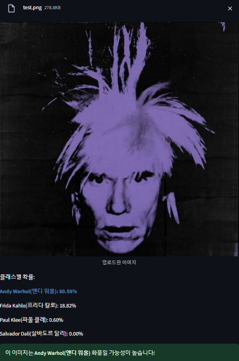

<p align="center">
  
  
  
  
</p>

# 화가 스타일 분류 AI 프로젝트

## 프로젝트 소개
이 프로젝트는 인공지능을 활용하여 그림의 화풍을 분석하고 어떤 화가의 작품인지 분류하는 모델을 구현했습니다. 4명의 유명 화가 작품을 학습시켜 새로운 그림이 어떤 화가의 스타일인지 예측합니다.

## 기술 스택
- Python
- TensorFlow / Keras
- Streamlit
- NumPy
- Pandas

## 파일 구조
- `pt.ipynb`: 화가 스타일 분류 모델 학습 코드
- `pt.py`: 화가 스타일 분류 모델 Streamlit 실행 파일
- `Pet1.ipynb`: 강아지/고양이 분류 모델 학습 코드
- `Pet.py`: 강아지/고양이 분류 Streamlit 실행 파일
- `requirements.txt`: 필요한 패키지 목록

## 설치 방법
프로젝트를 실행하기 위해 다음 단계를 따라주세요:

```bash
# 저장소 클론
git clone [저장소 URL]
cd [프로젝트 폴더명]

# 필요한 패키지 설치
pip install -r requirements.txt
```

## 실행 방법
설치가 완료되면 다음 명령어로 애플리케이션을 실행할 수 있습니다:

```bash
# 화가 스타일 분류 모델 실행
streamlit run pt.py

# 강아지/고양이 분류 모델 실행 (선택사항)
streamlit run Pet.py
```

## 데이터셋
이 프로젝트는 다음 데이터셋을 활용했습니다:
- 화가 스타일 분류: Kaggle의 "Collections of Paintings from 50 Artists" 데이터셋에서 4명의 화가 작품으로 범위를 좁혀 학습
- 강아지/고양이 분류: 기본 CNN 모델을 활용한 이미지 분류 실험

## 개발 후기 및 느낀점

이번 프로젝트를 진행하면서 처음에 계획했던 방향은 지금과 조금 달랐습니다. 처음에는 Kaggle에서 "I'm Something of a Painter Myself"라는 이미지를 업로드하면 모네 그림 스타일로 변환하는 챌린지를 발견했는데, 주제가 흥미로워서 도전해보고 싶었습니다. 참가자들의 코드를 따라 해봤지만, 배우지 않은 내용이 너무 많았고 학습 과정에서 기술적 문제(빈번한 튕김 현상 등)로 인해 반나절을 허비하게 됐습니다.

남은 시간은 하루와 PPT 작성에 반나절뿐이라 시간이 촉박했어요. 결국 좀 더 간단한 주제로 방향을 틀어서 CNN 기반으로 강아지와 고양이를 분류하는 모델을 만들어봤습니다(`Pet1.ipynb`와 `Pet.py`). 모델은 나름 완성했는데, 털이 많거나 귀가 쫑긋한 강아지를 자꾸 고양이로 오분류 하더라고요. 그래도 프로토타입 화면과 PPT까지 다 준비했지만, 더 흥미로운 주제를 발견하게 되었습니다.

그 후에 시간이 조금 남아서 다시 Kaggle을 뒤적이다가 "Collections of Paintings from 50 Artists"라는 데이터셋을 발견했습니다. 아무래도 그림 주제에 대한 미련이 마음 한구석에 남아 있었던 것 같아요. 결국 그림에 대한 집착그


# 화가 스타일 분류 AI 프로젝트

## 프로젝트 미리보기
### 결과 예시
아래는 모델이 화가의 스타일을 예측한 결과의 예시입니다:



## 데이터셋
이 프로젝트는 [Kaggle의 "Collections of Paintings from 50 Artists"](https://www.kaggle.com/datasets/your-dataset-link) 데이터셋을 활용했습니다.


## 슬라이드 보러가기
(https://docs.google.com/presentation/d/1cUOAMa4dIkE8Jgqz4cmztoy88HTg_Us6KGSWVto1Clg/edit#slide=id.p1)
